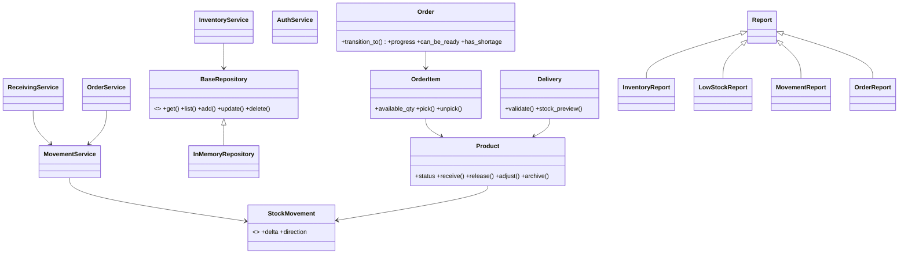

# WIMS architecture

## Layers

1. **Domain** contains entities, enums, and exceptions. Entities own rules such as stock status and order transitions.
2. **Repositories** define persistence operations. The current in-memory implementation can later be replaced with SQLAlchemy/MySQL subclasses.
3. **Services** coordinate use cases and receive repositories through constructors, keeping controllers free of business logic.
4. **Web** contains thin Flask blueprints. They translate HTTP input into service calls and render the existing templates.
5. **Reports** use one report contract with polymorphic implementations so each report can build and export its own rows.

`Container.build()` is the composition root. It creates repositories, injects them into services, and exposes those services to the blueprints through `current_app.container`.
